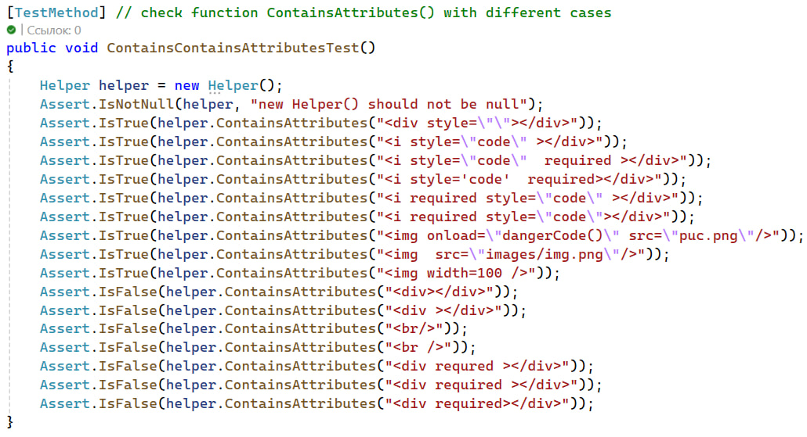
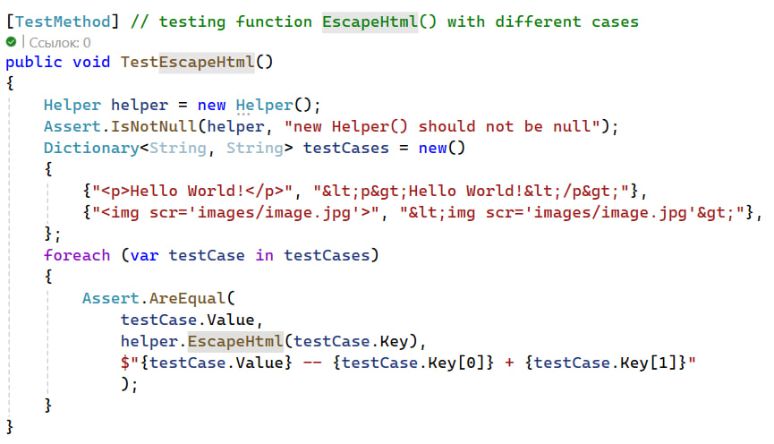
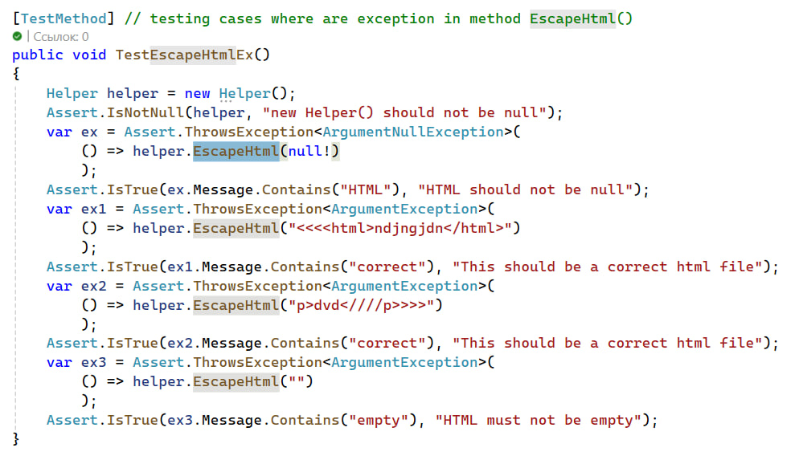

# Project Management - Управление проектам

## Тестирование случая наличия .. и большего количества /// в аргументах для функции CompineUrl() класса Helper

## Тестирование на наличие null в различном количестве и последовательности в аргументах для функции CompineUrl() класса Helper

## Тестирование функции ContainsAttribute() класса Helper

## Тестирование функции EscapeHtml() класса Helper

## Тестирование ситуаций возникновений исключений в функции EscapeHtml() класса Helper

